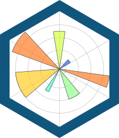
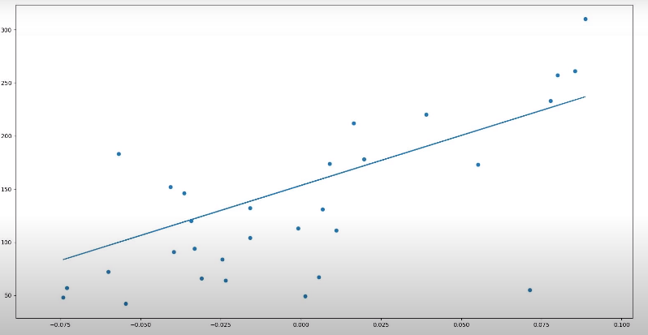
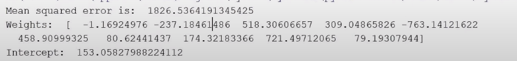

# Diabetes Predictor<br>
### Description
It is a linear regression base Machine Learning model, that can predict the diabetes level.

### LinearRegressionModel-1 
Here we have to fit the line so we will take only one feature and one label from the dataset. 
and plot into the linearRegressionGraph. 

### LinearRegressionModel-2 
Here we are not making a graph, rather we are taking all the features to bring more accuracy to our Linear regression model.
It will give more presise and accurate output than LinearRegressionModel-1 .
Our Mean squared error became almost half because here we have used more relevant features to calculate it.


### Tools and Languages:




<br>

### Installing Libraries
-Code snippet 1

```cmd
pip install numpy
pip install sklearn
pip install matplotlib

```

-> We will use matplotlib library to draw our graph. Sklearn provides us with some default datasets which we can use to test our models. 
To import datasets from sklearn we can simply import them through sklearn library. 
In this program, we will take the dataset of diabetes from the sklearn library which will help us to identify if someone has diabetes.

### Steps to follow
-Install the given libraries<br>
-Download the code from the given github repository<br>
-Run the code<br>

### Breaking the code

-Code snippet 2
```python
diabetes = datasets.load_diabetes()

print(diabetes.keys())

print(diabetes.DESCR)
```
As shown in code snippet 2, we had assigned the dataset of diabetes to variable diabetes.
(diabetes.keys()) gives Some description about the features from the dataset.
(diabetes.DESCR) gives a brief description on Data Set Characteristics.

-Code snippet 3
```python
diabetes_X = diabetes.data[:, np.newaxis, 2]

diabetes_X_train  = diabetes_X[:-30]
diabetes_X_test = diabetes_X[-30:]
```
 
As we have to fit the line that’s why we will take only one feature and one label from the dataset. 
We have only taken the index (2) from the dataset because we only need one feature 

-Code snippet 4
```python
model = linear_model.LinearRegression()
model.fit(diabetes_X_train, diabetes_y_train)
diabetes_y_predicted = model.predict(diabetes_X_test)

print(“Mean squared error is:  ”, mean_squared_error(diabetes_y_test, diabetes_y_predicted))
print(“Weights:  ”,  model.coef_)
print(“Intercept:  ”,  model.intercept_)
```
Here we have created our linear regression model. We have passed the training data to the (model.fit) then we will pass the testing data for prediction.
Then we have printed the values for mean squared error, weights and intercept.

-Code snippet 5
```python
plt.scatter(diabetes_X_test, diabetes_y_test)
plt.plot(diabetes_X_test, diabetes_y_ predicted)
plt.show()
```
In the code snippet 4, we have plotted the graph by using the testing features and labels. After that, we had made a line by using the predicted values of (y) from linear model. 
The output graph made using matplotlib is shown below.

### Linear Regression graph:



In this program, we had only selected one feature but if we select multiple features for the same program then the output will be much better as shown in the figure below.

### Output


### Developed by:
<a href="https://github.com/sambit221">Sambit Kumar Tripathy</a>
